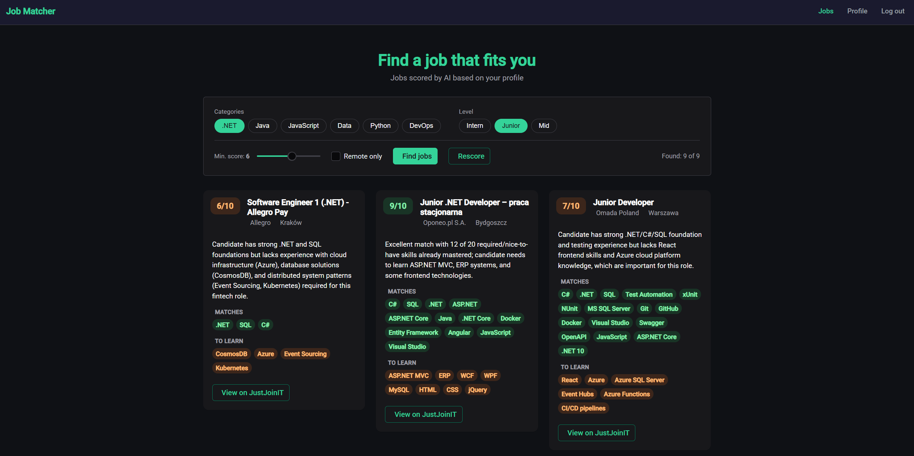
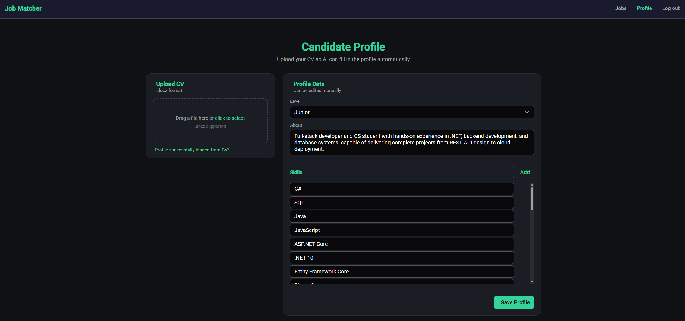

# Job Matcher

AI-powered job matching for IT positions in Poland. Fetches listings from JustJoinIT, scores each one against your CV using Claude, and explains what matches and what you'd need to learn.

**Live demo:** [jobmatcher-zanko.vercel.app](https://jobmatcher-zanko.vercel.app)

---

## What it does

Job boards let you filter by tag. That tells you a listing mentions C#, not whether you're actually a fit for it.

Job Matcher reads the full job description and compares it against your real skill set:

1. **Upload your CV** (`.docx`) — Claude parses it into a structured profile (skills, level, summary)
2. **Pick filters** — category (.NET, Java, JavaScript, Data, Python, DevOps) and experience level
3. **Get scored results** — each listing gets a 1–10 score, a list of skills you already match, a list of gaps you'd need to close, and a one-sentence verdict

Results stream in as they're scored, so you see matches appear one by one instead of waiting for the whole batch.

---

## Screenshots

**Dashboard** — filters, AI-scored jobs, and skill gaps



**Profile** — CV upload and parsed skill list



---

## Tech stack

**Backend** — ASP.NET Core (.NET 10)
- EF Core + PostgreSQL
- JWT authentication with BCrypt password hashing
- Claude Haiku for scoring and CV parsing
- `DocumentFormat.OpenXml` for `.docx` text extraction
- NDJSON streaming responses

**Frontend** — Angular 21
- Standalone components, signals, new control flow (`@if` / `@for`)
- PrimeNG (Aura dark theme)
- Reactive forms, JWT interceptor, route guards

**Infrastructure**
- Backend + PostgreSQL on Railway
- Frontend on Vercel
- Auto-deploy on push to `master`

---

## Architecture

```
JobMatcher/
├── JobMatcher.API/              ASP.NET Core backend
│   ├── Controllers/             HTTP layer only
│   ├── Data/                    EF Core DbContext
│   ├── Models/
│   │   ├── Domain/              Business objects
│   │   ├── External/            DTOs for JustJoinIT and Claude
│   │   └── Persistence/         EF entities
│   ├── Repositories/            Data access
│   └── Services/
│       ├── Claude/              Claude scoring + CV parsing
│       ├── Gemini/              Gemini alternative (swappable)
│       ├── JustJoinIt/          Job fetching
│       └── Interfaces/          Abstractions for DI
└── job-matcher-ui/              Angular frontend
    └── src/app/
        ├── dashboard/           Filters + results grid
        ├── job-card/            Single scored job
        ├── login/               Auth screen
        ├── profile-editor/      CV upload + profile editing
        └── services/            API client, auth, guards
```

### Design decisions

**AI provider is swappable.** `IAiScoringService` and `IAiCvParserService` abstract the AI backend. Claude and Gemini implementations both exist — switching is one line in `Program.cs`. Claude Haiku is the default; it's roughly 20× cheaper than Sonnet and handles structured JSON output fine.

**CV text is extracted before it reaches the AI.** Rather than sending the file directly, `DocxTextExtractorService` pulls out plain text first. This keeps CV parsing provider-agnostic — different AI APIs handle file uploads differently, but they all take text.

**Scoring uses the full job body, not just skill tags.** The listing endpoint only returns tags, so each new offer triggers a second fetch by slug to get the full description. Scoring tags alone would be no better than the site's own filters.

**Job offers are shared, scores are per-user.** `JobOffers` is a common cache — fetching the same listing once serves everyone. `ScoredJobs` is keyed by `UserId`, since the same job scores differently against different profiles.

**Pagination stops early on repeats.** The fetcher sorts by newest and stops after 5 consecutive already-known offers, which cuts HTTP calls sharply on repeat runs. Offers missed by that early stop are recovered from the database by category and level.

**Streaming is line-by-line.** Returning `IAsyncEnumerable` directly gets buffered by ASP.NET Core. The controller writes each NDJSON line and calls `Response.Body.FlushAsync()` explicitly so results actually arrive incrementally.

---

## API

```
POST /api/auth/register        Public — returns JWT
POST /api/auth/login           Public — returns JWT

GET  /api/offers/fetch         Job metadata
GET  /api/offers/score         Score with default profile
POST /api/offers/score         Score with supplied profile and filters
POST /api/offers/score/stream  Same, streamed as NDJSON

POST /api/cv/upload            .docx → parsed CandidateProfile
```

All `/api/offers` and `/api/cv` endpoints require `Authorization: Bearer <token>`.

### Request body for scoring

```json
{
  "profile": {
    "skills": ["C#", "ASP.NET Core", "SQL"],
    "level": "junior",
    "description": "CS student, backend focus"
  },
  "filters": {
    "categories": ["net", "java"],
    "experienceLevels": ["junior", "mid"]
  },
  "minScore": 6,
  "forceRescore": false
}
```

---

## Running locally

### Prerequisites

- .NET 10 SDK
- Node.js 20+
- PostgreSQL (local instance or a hosted one)
- An [Anthropic API key](https://console.anthropic.com)

### Backend

Create `JobMatcher.API/appsettings.Development.json` — this file is gitignored:

```json
{
  "ConnectionStrings": {
    "DefaultConnection": "Host=localhost;Port=5432;Database=jobmatcher;Username=postgres;Password=yourpassword"
  },
  "ClaudeApi": {
    "ApiKey": "sk-ant-..."
  },
  "Jwt": {
    "Key": "at-least-32-characters-long-random-string",
    "Issuer": "JobMatcher",
    "Audience": "JobMatcherUsers"
  },
  "Cors": {
    "AllowedOrigins": ["http://localhost:4200"]
  }
}
```

Then:

```bash
cd JobMatcher.API
dotnet run
```

Runs on `http://localhost:5212`. Tables are created automatically on first start via `EnsureCreated()`.

### Frontend

```bash
cd job-matcher-ui
npm install
npm start
```

Runs on `http://localhost:4200`. `proxy.conf.json` forwards `/api` to the backend, so no CORS setup is needed in development.

---

## Deployment

Both services auto-deploy on push to `master`.

**Backend (Railway)** — root directory `JobMatcher.API`, with these environment variables:

```
ConnectionStrings__DefaultConnection
ClaudeApi__ApiKey
Jwt__Key
Jwt__Issuer
Jwt__Audience
Cors__AllowedOrigins__0
```

ASP.NET Core maps `__` to `:`, so `Jwt__Key` fills `Jwt:Key`. Use Railway's internal hostname (`postgres.railway.internal`) in the connection string so traffic stays on the private network.

**Frontend (Vercel)** — root directory `job-matcher-ui`, build command `npm run build`, output `dist/job-matcher-ui/browser`. The production API URL lives in `src/environments/environment.prod.ts` and is swapped in at build time via `fileReplacements` in `angular.json`.

---

## Known limitations

- `EnsureCreated()` doesn't migrate schemas. Changing an entity means dropping and recreating the database. Moving to EF Core migrations is the next step if the schema keeps evolving.
- Changing your profile doesn't invalidate cached scores automatically — use the **Rescore** button to force a fresh pass.
- Offers older than 30 days are deleted on each run, along with their scores.
- The candidate profile lives in `localStorage`, keyed by user id. It doesn't sync across devices.

---

## License

MIT
